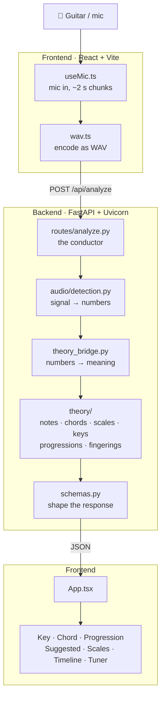

# Spiralis

A one-stop shop for aspiring musicians, accomplished songwriters, and anyone who wants to play around in a musical playground.

Play your guitar into your mic and **Spiralis** tells you what you're playing: the notes, the chord, the key, and everything that comes with it. That means scales, diatonic chords, circle-of-fifths neighbors, where the progression can go next, and different ways to finger it on a guitar neck.

Each source file opens with a header explaining the science behind it. This README covers the path through the program. Follow it, then open whichever file you're curious about.

---

## Running Spiralis locally

You need **two terminals**: one for the backend and one for the frontend.

### Backend: FastAPI on `:8000`

```bash
cd backend
python3 -m venv .venv
source .venv/bin/activate        # Windows: .venv\Scripts\activate
pip install -r requirements.txt
uvicorn app.main:app --reload
```

After the first setup, one line is enough:

```bash
cd backend && source .venv/bin/activate && uvicorn app.main:app --reload
```

### Frontend: Vite on `:5173`

In a second terminal:

```bash
cd frontend
npm install
npm run dev
```

Then open **http://localhost:5173**.

> [!NOTE]
> Start the backend first. Vite proxies `/api` requests to it, so the frontend has nothing to talk to otherwise.
>
> The browser needs microphone access. It doesn't always ask right away, but pressing **Play** triggers the permission prompt.

---

## How it works

Spiralis takes the sound from your guitar, turns it into numbers, interprets those numbers as music theory, and sends the results back to the browser.



### The short version

| Step | Where | What happens |
|---|---|---|
| 1 | `frontend/src/audio/useMic.ts` | Opens the mic with voice processing **off** (echo cancellation and noise suppression distort sustained notes) and buffers ~2 s of audio |
| 2 | `frontend/src/audio/wav.ts` | Encodes the chunk as a WAV file and sends it to `/api/analyze` |
| 3 | `backend/app/audio/detection.py` | Turns audio into numbers with Essentia: FFT → spectral peaks → chroma (HPCP) → beats → pitch-class sets like `{0, 4, 7}` |
| 4 | `backend/app/theory_bridge.py` | Hands those numbers to `theory/`, which names the notes, chord, key, scales, Roman numerals, next-chord suggestions, and fingerings |
| 5 | `backend/app/schemas.py` | Shapes everything into one JSON response |
| 6 | `frontend/src/App.tsx` | Fans the response out to each panel on screen |

The important separation: **`detection.py` never names a chord.** It only produces numbers 0–11. **`theory_bridge.py` is the only door into `theory/`**, and that's where the numbers become music. 

---

## Project layout

```text
backend/
├── requirements.txt
├── app/
│   ├── main.py              app, CORS, router setup
│   ├── schemas.py           response shapes
│   ├── theory_bridge.py     numbers → music theory
│   ├── routes/
│   │   └── analyze.py       POST /api/analyze: detection, then theory
│   └── audio/
│       └── detection.py     all Essentia processing
└── theory/
    ├── notes.py             pitch class ↔ note name + spelling
    ├── chords.py            pitch-class set → chord name
    ├── scales.py            modes and scales that fit
    ├── circle_of_fifths.py  key + nearby keys
    ├── progressions.py      Roman numerals + likely next chords
    └── fingerings.py        guitar chord and scale voicings

frontend/src/
├── main.tsx                 mounts <App />
├── App.tsx                  layout + the analyze loop
├── api.ts                   POSTs each chunk to the backend
├── types.ts                 shared response types
├── audio/
│   ├── useMic.ts            mic capture, ~2 s chunks
│   ├── wav.ts               Float32 → WAV
│   └── pitch.ts             frequency → note + cents for the tuner
└── components/              one file per panel
```

See [`docs/relevantResearch.md`](docs/relevantResearch.md) for background reading.